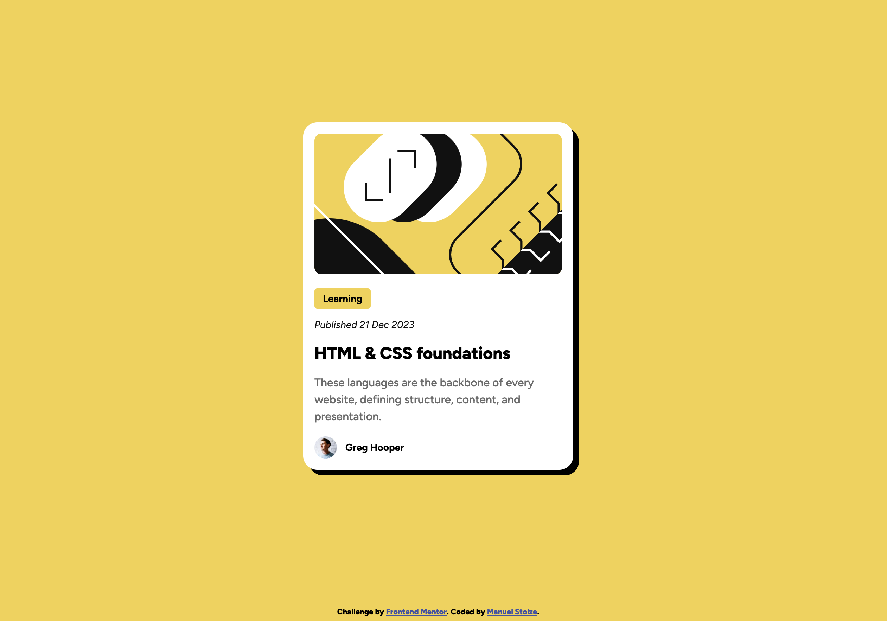

# Frontend Mentor - Blog preview card solution

This is a solution to the [Blog preview card challenge on Frontend Mentor](https://www.frontendmentor.io/challenges/blog-preview-card-ckPaj01IcS). Frontend Mentor challenges help you improve your coding skills by building realistic projects. 

## Table of contents

- [Overview](#overview)
  - [The challenge](#the-challenge)
  - [Screenshot](#screenshot)
  - [Links](#links)
- [My process](#my-process)
  - [Built with](#built-with)
  - [What I learned](#what-i-learned)
- [Author](#author)

## Overview

### The challenge

Users should be able to:

- See hover and focus states for all interactive elements on the page

### Links

- Solution URL: [Github](https://github.com/manuelstolze/blog-preview-card)
- Live Site URL: [Vercel App](https://blog-preview-card-jet-chi.vercel.app/)

## My process

### Built with

- Semantic HTML5 markup
- CSS custom properties
- Flexbox
- CSS Grid
- Mobile-first workflow

### What I learned

The main focus was to use the grid system of css and combine it with flexbox. I also learned how to use the `object-fit` property to make the image fit the container.

## Author

- Website - [Manuel Stolze](https://github.com/manuelstolze)
- Frontend Mentor - [@manuelstolze](https://www.frontendmentor.io/profile/manuelstolze)
